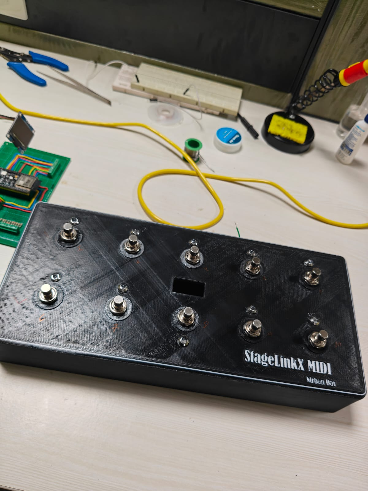
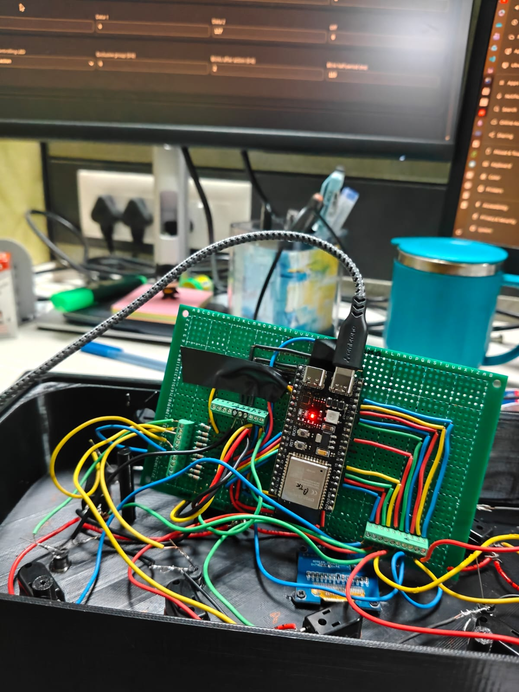
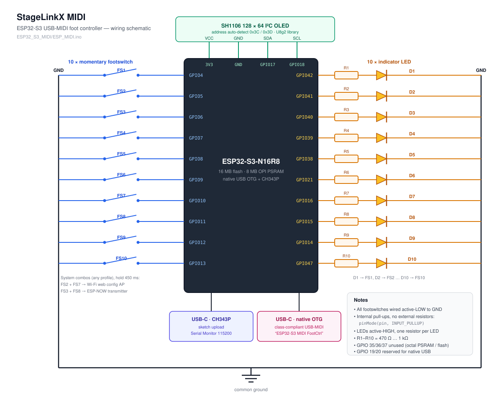
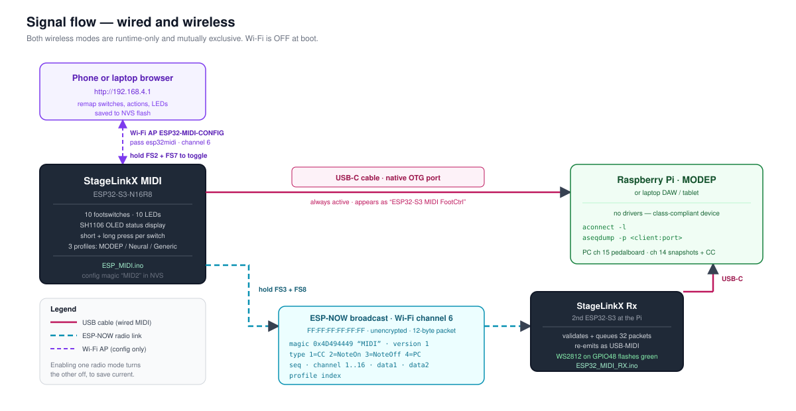

# StageLinkX MIDI — ESP32-S3 Foot Controller

A 10-switch, 10-LED USB-MIDI foot controller built around an ESP32-S3, with an on-demand
Wi-Fi web configurator, an OLED display, and an optional ESP-NOW wireless link to a second
ESP32-S3 that re-emits the MIDI over USB.

Built for [MODEP](https://blokas.io/modep/) on a Raspberry Pi, but the mappings are fully
configurable so it works with Neural DSP plugins, DAWs, or anything that speaks MIDI.



## Video

[](https://www.youtube.com/watch?v=s7U2gFSTf6M)

▶ **[Watch the build and demo on YouTube](https://www.youtube.com/watch?v=s7U2gFSTf6M)**

## Inside the box

Perfboard build: ESP32-S3-N16R8 in the middle, screw terminals for the ten footswitches and
ten LEDs, SH1106 OLED at the top left, both USB-C ports broken out to the rear panel.



## Highlights

- **10 footswitches**, each with an independent short-press and long-press action
- **10 LEDs** with six behaviour modes, including exclusive groups for snapshot selection
- **Class-compliant USB-MIDI** straight from the ESP32-S3 native USB OTG port — no drivers
- **On-demand web configurator**: hold FS2+FS7 to raise a Wi-Fi AP and remap everything from
  a phone. No re-flashing required.
- **ESP-NOW wireless mode**: hold FS3+FS8 to also broadcast MIDI to a receiver board plugged
  into the Pi, so the pedalboard needs no USB cable running to it
- **Three profiles** (MODEP, Neural DSP, Generic), stored in flash and restored on boot
- **Wi-Fi off at boot** — the radio only powers up when you ask for it

There is also a legacy 6-switch Raspberry Pi Pico / MicroPython version, kept in
[MicroPython/](MicroPython/) and documented at the end of this file.

## Repository layout

```text
MIDIFootController/
├── README.md
├── Images/
│   ├── Box.jpeg                  # finished enclosure
│   ├── ProtoBoard.jpeg           # perfboard wiring
│   ├── Schematic.svg             # controller wiring schematic
│   └── SystemDiagram.svg         # wired + wireless signal flow
├── ESP32_S3_MIDI/
│   ├── ESP_MIDI.ino              # main foot controller firmware
│   └── ESP32_MIDI_RX.ino         # ESP-NOW -> USB-MIDI receiver firmware
└── MicroPython/
    └── main.py                   # legacy 6-switch Pico firmware
```

> The two `.ino` files are two **separate** sketches for two different boards. Arduino wants
> one sketch per folder, so copy each into its own folder named after the file (for example
> `ESP_MIDI/ESP_MIDI.ino`) before opening it, or open them one at a time.

---

# Hardware

## Bill of materials

### Controller (transmitter)

| Qty | Part |
| ---: | --- |
| 1 | ESP32-S3-N16R8 dev board with **two** USB-C ports (native USB OTG + CH343P) |
| 10 | Normally-open momentary footswitches |
| 10 | 3 mm or 5 mm LEDs |
| 10 | 470 Ω – 1 kΩ resistors (one per LED) |
| 1 | SH1106 1.3" 128×64 I²C OLED (0x3C or 0x3D) |
| 1 | Enclosure (the one pictured is 3D printed), hookup wire, screw terminals |

### Optional wireless receiver

| Qty | Part |
| ---: | --- |
| 1 | Second ESP32-S3 board with native USB OTG and an onboard WS2812 LED on GPIO 48 |

## Schematic

[](Images/Schematic.svg)

The receiver board needs **no external wiring at all** — it uses its onboard WS2812 LED on
GPIO 48 for status, and only the two USB-C ports. Flash it and plug it in.

## Pinout

Footswitches are wired **active-low**: GPIO → switch → GND, using the internal pull-ups.
No external pull-up resistors are needed.

| Switch | GPIO | LED GPIO |
| --- | ---: | ---: |
| FS1 | 4 | 42 |
| FS2 | 5 | 41 |
| FS3 | 6 | 40 |
| FS4 | 7 | 39 |
| FS5 | 8 | 38 |
| FS6 | 9 | 21 |
| FS7 | 10 | 16 |
| FS8 | 11 | 15 |
| FS9 | 12 | 14 |
| FS10 | 13 | 47 |

LEDs are active-high: GPIO → resistor → LED anode, LED cathode → GND.

OLED:

```text
3V3     ---- OLED VCC
GND     ---- OLED GND
GPIO17  ---- OLED SDA
GPIO18  ---- OLED SCL
```

GPIO 35/36/37 are deliberately unused — the N16R8 module wires them to octal PSRAM/flash.
GPIO 19/20 are left free for native USB.

## The two USB-C ports

| Port | Use |
| --- | --- |
| CH343P USB-C | Sketch upload and Serial Monitor (115200 baud) |
| Native USB OTG USB-C | Class-compliant USB-MIDI device |

Upload through the CH343P port. Plug the native OTG port into whatever should receive MIDI —
Raspberry Pi, laptop, or tablet. Both can be connected at once, which is handy while
debugging.

---

# Firmware: `ESP32_S3_MIDI/ESP_MIDI.ino`

## Build settings

Install ESP32 board support in Arduino IDE (`File > Preferences > Additional boards manager
URLs`):

```text
https://raw.githubusercontent.com/espressif/arduino-esp32/gh-pages/package_esp32_index.json
```

Then install `esp32` by Espressif Systems from `Tools > Board > Boards Manager`.

Libraries (`Tools > Manage Libraries`):

| Sketch | Library |
| --- | --- |
| `ESP_MIDI.ino` | **U8g2** by oliver |
| `ESP32_MIDI_RX.ino` | **Adafruit NeoPixel** |

Board settings for **both** sketches:

| Setting | Value |
| --- | --- |
| Board | ESP32S3 Dev Module |
| USB Mode | USB-OTG / TinyUSB |
| USB CDC On Boot | **Disabled** |
| USB DFU On Boot | **Disabled** |
| Flash Size | 16MB |
| PSRAM | OPI PSRAM |

`USB CDC On Boot` must stay disabled so the native port enumerates purely as a MIDI device.
Serial output goes over the CH343P port instead. The receiver sketch enforces this with a
`#error` at compile time.

Expected serial output on boot:

```text
ESP32-S3 USB-MIDI + On-demand Web + ESP-NOW + LEDs
Loaded saved MID2 configuration.
SH1106 OLED found. U8g2 address = 0x78
USB-MIDI started.
Wi-Fi is OFF at boot to reduce power.
Hold FS2+FS7: toggle web configuration AP.
Hold FS3+FS8: toggle ESP-NOW transmitter.
```

The device appears to the host as **`ESP32-S3 MIDI FootCtrl`**.

## Switch behaviour

Each switch has a **short action** and a **long action**, with a per-switch long-press
threshold (default 650 ms, configurable 250–5000 ms).

- If a switch has **no long action**, the short action fires immediately on press — lowest
  possible latency.
- If a switch **has** a long action, the short action is deferred until release, so holding
  the switch sends only the long command and never both.
- FS2, FS3, FS7 and FS8 always defer to release, because they take part in the system combos.

Debounce is 35 ms.

### Available actions

| Action | Behaviour |
| --- | --- |
| None | Nothing |
| CC Toggle | Alternates between the ON value and the OFF value on each press |
| CC Momentary | ON value while held, OFF value on release |
| Note Pulse | Note-on, 12 ms, note-off |
| Note Momentary | Note-on while held, note-off on release |
| Program Change | Sends the configured program number |
| Bank/Pedalboard Up | Increments the pedalboard counter (wraps) and sends it as a PC |
| Bank/Pedalboard Down | Decrements the pedalboard counter (wraps) and sends it as a PC |
| Profile Next / Prev | Switches the active profile and saves it |

Each action stores a MIDI channel (1–16), Data 1 (CC / note / program), Data 2 (ON value or
velocity), and an OFF value.

## LED behaviour

| LED mode | Behaviour |
| --- | --- |
| Off | Never lit |
| Always ON | Lit permanently — good for bank up/down switches |
| While switch held | Follows the physical switch |
| Toggle | Flips on every triggering action |
| Exclusive group | Lights this LED and clears every other LED in the same group (1–8) |
| Follow CC toggle | Mirrors the ON/OFF state of a CC Toggle action |

Each LED also has:

- **Trigger** — whether the short action, the long action, or both update it
- **Blink count** (0–6) and **blink half-period** (40–1000 ms) — a non-blocking confirmation
  flash after the action fires, starting opposite the resting state so even an always-on LED
  visibly blinks

## Default profiles

Profiles are stored in NVS flash (namespace `midicfg`, config magic `MID2`) and survive
power cycles. Anything below can be changed from the web UI.

### MODEP

Pedalboard changes go out on **channel 15**, snapshots and CC toggles on **channel 14**.
Pedalboard count defaults to 16.

| Switch | Short press | Long press | LED |
| --- | --- | --- | --- |
| FS1 | Pedalboard up | — | Always ON, 2 blinks |
| FS2 | PC 1 — Snapshot 1 | CC 20 toggle — Tuner | Exclusive group 1 |
| FS3 | PC 2 — Snapshot 2 | CC 21 toggle — Delay | Exclusive group 1 |
| FS4 | PC 3 — Snapshot 3 | CC 22 toggle — Reverb | Exclusive group 1 |
| FS5 | PC 4 — Snapshot 4 | CC 23 toggle — Boost/OD | Exclusive group 1 |
| FS6 | Pedalboard down | — | Always ON, 2 blinks |
| FS7 | PC 5 — Snapshot 5 | — | Exclusive group 1 |
| FS8 | PC 6 — Snapshot 6 | — | Exclusive group 1 |
| FS9 | PC 7 — Snapshot 7 | — | Exclusive group 1 |
| FS10 | PC 8 — Snapshot 8 | — | Exclusive group 1 |

Because the snapshot LEDs share exclusive group 1, only the most recently selected snapshot
stays lit.

### Neural DSP

Channel 1. All ten switches send a note pulse; LEDs toggle.

| Switch | FS1 | FS2 | FS3 | FS4 | FS5 | FS6 | FS7 | FS8 | FS9 | FS10 |
| --- | ---: | ---: | ---: | ---: | ---: | ---: | ---: | ---: | ---: | ---: |
| Note | 36 | 37 | 38 | 39 | 40 | 41 | 42 | 43 | 44 | 45 |

### Generic

Channel 1. All ten switches are CC toggles between 127 and 0; LEDs follow the toggle state.

| Switch | FS1 | FS2 | FS3 | FS4 | FS5 | FS6 | FS7 | FS8 | FS9 | FS10 |
| --- | ---: | ---: | ---: | ---: | ---: | ---: | ---: | ---: | ---: | ---: |
| CC | 20 | 21 | 22 | 23 | 24 | 25 | 26 | 27 | 28 | 29 |

> No switch is bound to *Profile Next/Prev* by default — all ten are free for musical duties.
> Switch profiles from the web UI, or assign the *Profile Next* / *Profile Previous* action to
> any switch (a long press works well for this).

## System combos

Two switch combinations work in every profile. Hold both for 450 ms; the normal actions of
those switches are suppressed when the combo fires.

| Combo | Effect |
| --- | --- |
| **FS2 + FS7** | Toggle the Wi-Fi web configuration AP |
| **FS3 + FS8** | Toggle the ESP-NOW wireless transmitter |

The two wireless modes are mutually exclusive — enabling one turns the other off — to keep
current draw and channel handling simple. Neither is persisted: every power-up starts in
plain, low-power USB-MIDI mode. The LEDs of the combo switches blink twice on enable and once
on disable, and the OLED confirms the new state.

## Web configurator

Hold **FS2 + FS7**. The OLED shows the SSID and IP.

| Setting | Value |
| --- | --- |
| SSID | `ESP32-MIDI-CONFIG` |
| Password | `esp32midi` |
| URL | `http://192.168.4.1` |
| Channel | 6 |

The page is a single self-contained dark-themed form served from the ESP32. From a phone you
can:

- Switch the active profile and rename it
- Set the default channel and total pedalboard count (1–127)
- Edit the label, short action, long action and long-press time for all ten switches
- Configure every LED mode, trigger, exclusive group, blink count and blink period
- Test an individual LED, force all LEDs on, or restore them
- Reset every mapping back to defaults

Saving writes straight to flash. Turn the AP back off with FS2 + FS7 when you are done.

Routes, if you want to script it:

| Route | Purpose |
| --- | --- |
| `GET /` | Editor, optional `?p=<profile>` |
| `GET /profile?p=<n>` | Set active profile |
| `POST /save` | Save the posted profile |
| `GET /reset` | Restore factory defaults |
| `GET /led-test?i=<n>` | Blink one LED three times |
| `GET /led-all?state=0\|1` | Force all LEDs on, or restore |

---

# Wireless mode: ESP-NOW

[](Images/SystemDiagram.svg)

Hold **FS3 + FS8** and the controller starts broadcasting every MIDI event over ESP-NOW on
Wi-Fi channel 6, *in addition* to the USB-MIDI output. A second ESP32-S3 running
[`ESP32_MIDI_RX.ino`](ESP32_S3_MIDI/ESP32_MIDI_RX.ino) sits at the Raspberry Pi, receives the
packets, and re-emits them as class-compliant USB-MIDI. The Pi sees an ordinary MIDI device
called **`StageLinkX Rx`**, and no cable runs to the pedalboard.

Packets are a 12-byte packed struct, broadcast to `FF:FF:FF:FF:FF:FF` so the first test is
plug-and-play:

```c
struct EspNowMidiPacket {
  uint32_t magic;     // 0x4D494449 "MIDI"
  uint16_t sequence;
  uint8_t  version;   // 1
  uint8_t  type;      // 1 CC, 2 NoteOn, 3 NoteOff, 4 ProgramChange
  uint8_t  channel;   // 1..16
  uint8_t  data1;
  uint8_t  data2;
  uint8_t  profile;
};
```

The receiver validates magic, version, type, channel and data range, queues up to 32 packets
from the callback, and drains the queue in `loop()` — the RX callback itself never touches
USB. Its onboard WS2812 on GPIO 48 flashes green on each forwarded packet, and dropped-packet
counts are reported over serial.

Wi-Fi power saving is disabled on both ends for predictable live-control latency. If the Pi's
USB power is marginal, run the receiver from a powered hub.

**Note:** broadcast ESP-NOW is unencrypted and unauthenticated. It is fine for a stage rig,
but anyone nearby on channel 6 could inject packets. To lock it down, replace the broadcast
address with the receiver's MAC (printed on boot) and enable ESP-NOW encryption.

---

# Testing on Linux

Confirm the MIDI device enumerates:

```bash
aconnect -l
```

Watch events live:

```bash
aseqdump -l
aseqdump -p <client:port>
```

Look for `ESP32-S3 MIDI FootCtrl` (direct USB) or `StageLinkX Rx` (wireless).

---

# Troubleshooting

**Upload fails.** Use the CH343P USB-C port, not the native OTG port, and select its serial
port in the IDE. Hold BOOT while tapping RST if the board needs manual bootloader entry.

**No MIDI device appears.** Check the native OTG port is connected to the host, `USB Mode` is
`USB-OTG / TinyUSB`, and `USB CDC On Boot` is disabled. Replug the native cable after upload.

**OLED is blank.** Check 3V3/GND/SDA/SCL. The sketch auto-detects 0x3C and 0x3D and prints
which it found; if neither is present it logs `OLED not found` and keeps running headless.
The display is an **SH1106** driven by U8g2 — an SSD1306 module needs the constructor changed
to `U8G2_SSD1306_128X64_NONAME_F_HW_I2C`.

**An LED never lights.** Confirm the wiring matches `LED_PINS[]`, check the series resistor
and LED polarity, then use *Test this LED* in the web UI to isolate hardware from config.

**Short press fires when I meant to long press.** Raise that switch's long-press time in the
web UI.

**Wireless mode does nothing.** Both boards must be on channel 6. Check the receiver's serial
output for `ESP-NOW receiver ready` and a rising dropped-packet count.

**Settings came back wrong after a firmware update.** The config struct is versioned by the
`MID2` magic. If the layout changes, the old blob is rejected and defaults are loaded — as
designed. Re-enter your mappings, or hit *Reset defaults*.

---

# Legacy: Raspberry Pi Pico firmware

The original 6-switch MicroPython version lives in [MicroPython/main.py](MicroPython/main.py).
It is MODEP-specific and has no display, LEDs, or wireless. Kept for reference.

Switch layout and GPIO mapping:

```text
Top row:     2 -- 1 -- 0        GP4  GP3  GP2
Bottom row:  5 -- 4 -- 3        GP28 GP6  GP5
```

Wired active-low to GND, using `Pin(gp, Pin.IN, Pin.PULL_UP)` — no external resistors.

| Switch | Short press | Long press |
| --- | --- | --- |
| 0 | Next pedalboard | — |
| 3 | Previous pedalboard | — |
| 2 | Snapshot 1 | CC 20 — Tuner |
| 1 | Snapshot 2 | CC 21 — Delay |
| 5 | Snapshot 3 | CC 22 — Reverb |
| 4 | Snapshot 4 | CC 23 — Boost/OD |

Long-pressing 0 + 3 together resets the pedalboard counter. Pedalboard PCs go out on MODEP
channel 15, snapshots and CCs on channel 14.

## Install

1. Flash the MicroPython UF2: hold `BOOTSEL`, plug in, copy the UF2 to the `RPI-RP2` drive.
2. Install the tooling and the USB MIDI package:

```bash
python3 -m pip install --user mpremote
mpremote connect list
mpremote connect /dev/ttyACM0 mip install usb-device-midi
```

3. Upload:

```bash
cd MicroPython
mpremote connect /dev/ttyACM0 resume fs cp ./main.py :main.py
mpremote connect /dev/ttyACM0 resume reset
```

`resume` matters here — this firmware enables runtime USB MIDI, and without it `mpremote` can
reset the Pico and lose the serial connection mid-copy.

Try it before installing it permanently:

```bash
mpremote connect /dev/ttyACM0 run --no-follow main.py
```

Expected output:

```text
MODEP 6-switch controller running
PB CH = 15 SS CH = 14 CC CH = 14
TOTAL_PBS = 16
```

If the port is busy, close Thonny or any serial monitor — `lsof /dev/ttyACM0` will show what
is holding it.

---

Built by Nirban Das.
